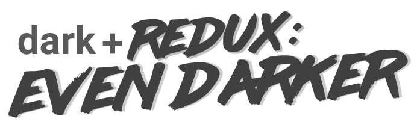

A hyper theme to match the vscode dark+ Redux: Even Darker theme; for those night-owls 🦉 and super-haxxors 👩‍💻 that live in a dark theme world.

# Darken all the things (in hyper) 😎

👨‍🏫 Tested with [oh-my-zsh](https://github.com/robbyrussell/oh-my-zsh) (in WSL) & [cmder](https://cmder.net).

🤞 Should work well for decently for most terminals.

😍 Designed to compliment those cool-kid programming fonts - like [Dank Mono](https://dank.sh/) or [Fira Code](https://github.com/tonsky/FiraCode)

# Example

# Extra Settings

The pictured terminal is using [oh-my-zsh](https://github.com/robbyrussell/oh-my-zsh) (in WSL) + [powerlevel9k](https://github.com/bhilburn/powerlevel9k),
with the following settings;

```
POWERLEVEL9K_MODE='awesome-fontconfig'
POWERLEVEL9K_LEFT_PROMPT_ELEMENTS=(dir vcs)
POWERLEVEL9K_RIGHT_PROMPT_ELEMENTS=(status root_indicator background_jobs node_version time_joined)

POWERLEVEL9K_TIME_FOREGROUND='059'
POWERLEVEL9K_TIME_BACKGROUND='237'

POWERLEVEL9K_BACKGROUND_JOBS_FOREGROUND='059'

POWERLEVEL9K_STATUS_ERROR_BACKGROUND='237'
POWERLEVEL9K_STATUS_ERROR_FOREGROUND='133'

POWERLEVEL9K_NODE_VERSION_FOREGROUND='059'
POWERLEVEL9K_NODE_VERSION_BACKGROUND='237'
```

# Author

🤔 created by Dan Harris

👨‍💻 website: [danharris.io](https://danharris.io)

🐤 twitter: [@danharris_io](http://twitter.com/danharris_io)

☕ made with love and late nights

# Odds & Ends

👀 MIT License

💖 if you've read this far... thanks for the star

😎 title font courtesy of the awesome [lazer84 font](http://sunrise-digital.net/lazer84/)

😡 please send all abusive letters via handwritten note to [this address](https://www.youtube.com/watch?v=dQw4w9WgXcQ)

📫 all constructive feedback welcome.
